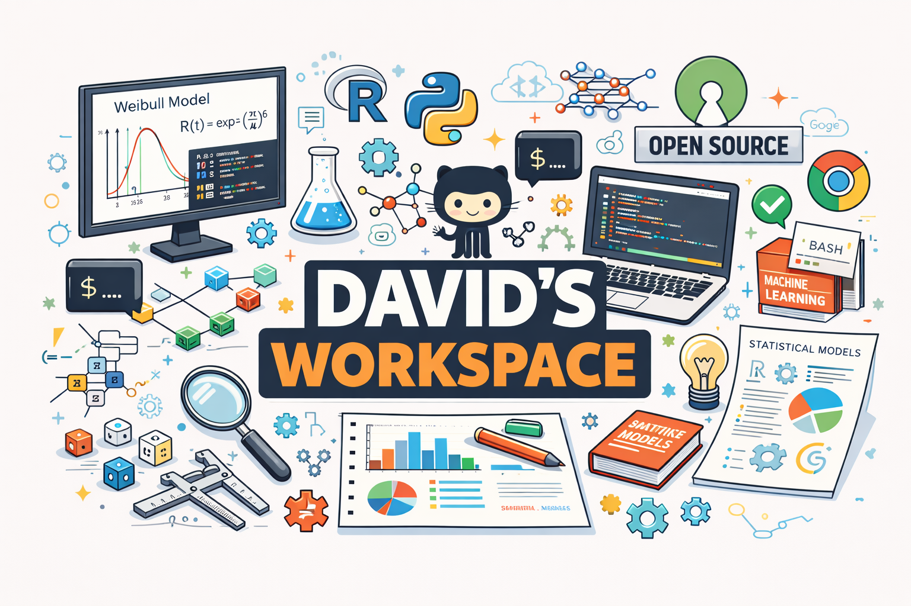

## Hello, friends from far and near. 

I'm David.

I live where data, models, and meaning meet. By day, I explore statistical modeling, optimization, and data science (with a soft spot for open source and healthcare). By night, I write poetry, essays, and ideas that live somewhere between faith and imagination.

This GitHub is my workbench: experiments, code that actually runs, research notes, books, and the occasional side quest. If you’re into stats, data science, curious questions, storytelling and thoughtful problem-solving, you’re in the right place.

Always learning. Occasionally overthinking. Constantly building.

<!--
**RealKingDavid/RealKingDavid** is a ✨ _special_ ✨ repository because its `README.md` (this file) appears on your GitHub profile.

Here are some ideas to get you started:

- 🔭 I’m currently working on ...
- 🌱 I’m currently learning ...
- 👯 I’m looking to collaborate on ...
- 🤔 I’m looking for help with ...
- 💬 Ask me about ...
- 📫 How to reach me: ...
- 😄 Pronouns: ...
- ⚡ Fun fact: ...
-->
